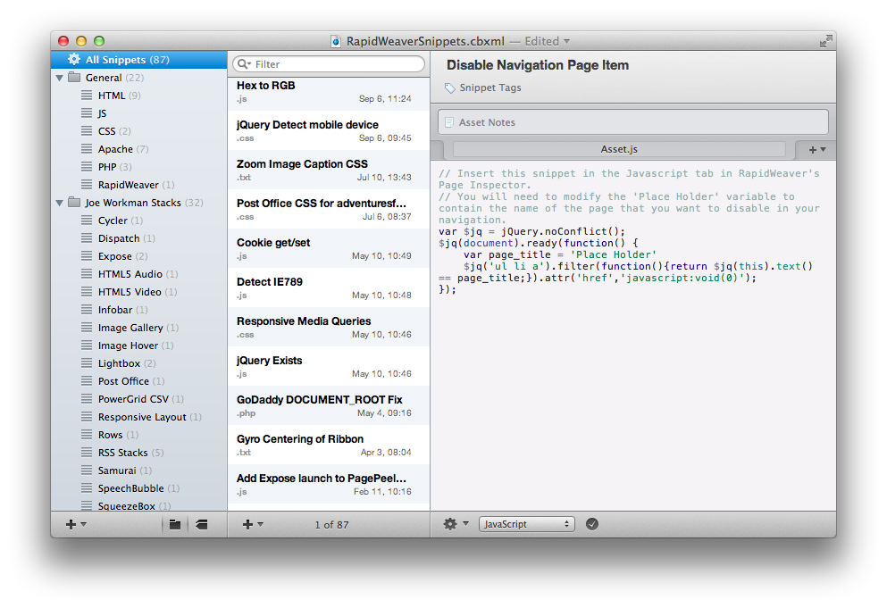

RapidWeaver Snippet Share
==========

The purpose of this reposiotry is to provice a place where the RapidWeaver User Community can access and share code snippets. These snippets could be for tweaking the styles of a stack with CSS or JavaScript snippets to help you do something with your theme. 

### What you need

There are two apps that you need to download in order to access and use these snippets. 

* [GitHub for Mac](http://mac.github.com)
* [CodeBox Snippets Manager](https://itunes.apple.com/us/app/codebox/id412536790?mt=12&uo=4&at=11l8IQ)

If you already use another git app or are a command-line geek, you do not need to use the GitHub.app. I recommend it because its free and integrats direclty with your github.com account.

CodeBox does cost $9.99. After reviewing many snippet managers, CodeBox was the best suited for this project. CodeBox saves the library as a XML file which makes it very compatable with version control systems like GitHub. This is a requirement. If you want to access this snippets collection, you will need to purchase CodeBox. 

### How to get the snippets library

After you download and install the GitHub for Mac application, you will need to launch the app and go through the setup process. Then simply click on the `Clone in Desktop` button on the right sidebar of this page. The repository will be opened in GitHub.app and prompt you to save the files locally. 

Now you just need to open the `RapidWeaverSnippets.cbxml` file from teh saved repository and it will open inside CodeBox. 

Now enjoy all of your snippets!

**Warning**: Its probably best, not to add your own snippets directly into this shared repository. CodeBox makes it easy to create multiple snippet libraries. Check out the section below on contributing if you would like to help contribute. 

### How to update the library with the latest changes

Open up Github.app and click the `Sync` button in the *rwsinppets* repository. This will download the latest version of the snippet library. 

Reopen CodeBox and you should have the latest and greatest snippets. 

### Want to contribute?

The more people that contribute to this project, the more powerful and useful it will be for everyone. There are a few ways that you can contribute. 

1. File an issue in this Github repository with the snippets that you would like to be added. If you want you could even attach a CodeBox library to the issue so that we can easily merge it in. 
2. Request that we add you as a collaborator to this project so that you can merge your changes in directly. You could also help merge in other user's changes that have filed issues. 
3. You could submit a pull request. If you understand that, you are geeky enough to know what it means. 